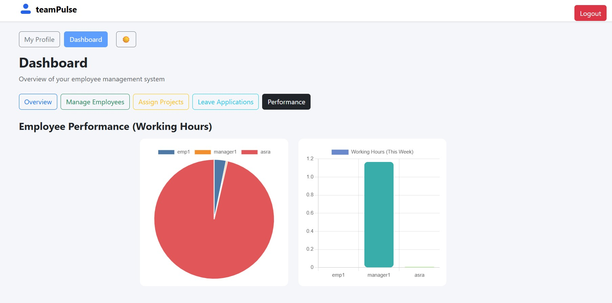

# Employee Management

A full-stack web application for managing employees, tracking attendance, handling leave requests, and visualizing performance. Built with **React** (frontend) and **Node.js/Express + MongoDB** (backend).

---

## Features

- **User Authentication** (Manager & Employee roles)
- **Employee CRUD** (Create, Read, Update, Delete) – Managers only
- **Project Assignment & Tracking**
- **Attendance Tracking**
- **Leave Application & Approval Workflow**
- **Inbox Notifications**
- **Performance Visualization** (Charts)
- **Recent Activities Feed**
- **Responsive UI** with Bootstrap

---

## Screenshots

### Login Page


### Manager Dashboard


### Employee Management


### Project Assignment


### Leave Management


### Performance Charts


### Employee Profile


---

## Tech Stack

- **Frontend:** React, Bootstrap, Chart.js
- **Backend:** Node.js, Express, Mongoose (MongoDB)
- **Database:** MongoDB Atlas (cloud) or local MongoDB

---

## Getting Started

### 1. Clone the repository

```sh
git clone https://github.com/your-username/your-repo-name.git
cd your-repo-name/empp1/empp/EmpTracker
```

### 2. Backend Setup

```sh
cd server
npm install
```

- Create a `.env` file in the `server` directory:
  ```
  MONGO_URI=your_mongodb_connection_string
  ```
- Start the backend server:
  ```sh
  node server.js
  ```
  The backend runs on `http://localhost:5000`

### 3. Frontend Setup

```sh
cd ../client
npm install
npm run dev
```
The frontend runs on `http://localhost:5173` (or as shown in your terminal).

---

## API Endpoints

- **Auth:** `POST /api/auth/login`
- **Employees:** `GET/POST/PATCH/DELETE /api/employees`
- **Projects:** `POST /api/employees/assign-project`, `PATCH/DELETE /api/employees/:username/projects/:index`
- **Leaves:** `POST /api/leaves`, `GET /api/leaves`, `PATCH /api/leaves/:id`
- **Attendance:** `GET /api/attendance/:username`, `POST /api/attendance`
- **Inbox:** `GET /api/inbox/:username`, `PATCH /api/inbox/:id/read`
- **Activities:** `GET /api/activities/recent`

---

## Usage

1. **Login** as a manager or employee.
2. **Managers** can add/edit/delete employees, assign projects, approve/deny leaves, and view performance.
3. **Employees** can view their profile, apply for leave, see assigned projects, and check attendance/performance.

---

## Postman

You can use [Postman](https://www.postman.com/) to test API endpoints.  
Create requests manually or import a collection if provided.

---

## License

MIT (or your chosen license)

---

## Credits

- Built by Asra Fathima Arzoo
